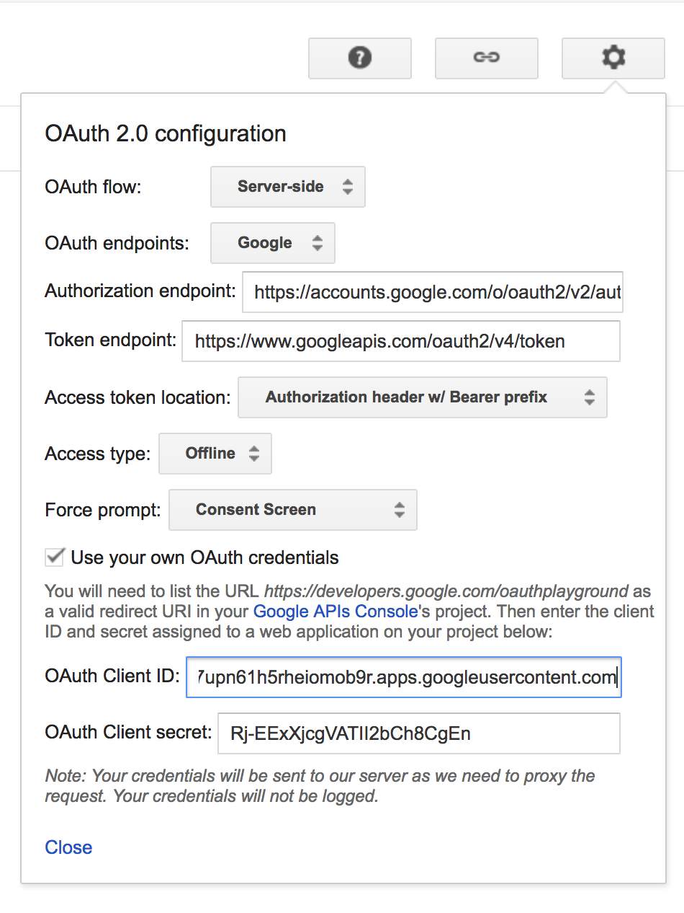

# youtube

* manifest
  * project: basic information for the project
    * email: email address used to login this channel
    * channelUrl: channel url
    * channelName: channel name *(used as part of file path when saving video list to s3)*
    * description: channel description
    * type: indicate where the video come from: youtube, meipai, youku... *(used as part of file path when saving video list to s3)*
  * credential
    * channelId: channelId for current project (only used in isTokenValid() method as a dummy parameter)
    * token_type: Bearer *(default)*  
    * expires_in: 3600 *(default)*
    * client_id: google app client_id *(used in youtube-video-api authentication)*
    * client_secret: google app client_secret *(used in youtube-video-api authentication)*
    * access_token: access_token *(used in youtube-video-api authentication)*
    * refresh_token: refresh_token *(used in youtube-video-api authentication)*
  * current
    * date: the date used to populate s3 file path
    * file: the file name to populate s3 file path
    * batch: how many items should be processed

  ```
  {
    "project": {
      "email": "blueangel.yt1@gmail.com",
      "channelUrl": "https://www.youtube.com/channel/UC70JN7kAPlgbAtqrV4wtPqg",
      "channelName": "抖音精品收藏",
      "description": "抖音精品收藏",
      "type": "youtube"
    },
    "credential": {
      "name": "youtube-douyin",
      "account": "blueangel.yt1@gmail.com",
      "token_type": "Bearer",
      "expires_in": 3600,
      "client_id": "299060033544-s484p2e63n0i454ajquoi7vid8upm62u.apps.googleusercontent.com",
      "client_secret": "5ckCg__TTynzEpT1Y6MfrbwX",
      "access_token":"ya29.Glv0BdpCPZGPqUVLgmIRhWUkbajVHWoaHP4YxYpYx25LCngHXue9SMaqtJszbnh7LgJul_YJd_P9RTEXMMvew9_9yUGU8j4HYv__8yhPcUKQwQPnL9vi4xU-uBAC",
      "refresh_token":"1/_CcbgzX4fW7WW5YMJv8kk0wvTzUnkpUWIzeOlGayUK982a2jZ4fjaxKXPnMTfxmx",
      "channelId": "UC70JN7kAPlgbAtqrV4wtPqg"
    },
    "current": {
      "date": "2018-8-8",
      "file": "1.json",
      "batch": "20"
    }
  }
  ```

* get `access_token` and `refresh_token` (*we used access_token and refresh_token in loader project via youtube-video-api because it involved insert operation*)
  * when using Oauth Playground to get `access_token` and `refresh_token`, remember to use our own `client_id` and `client_secret`
  * 
